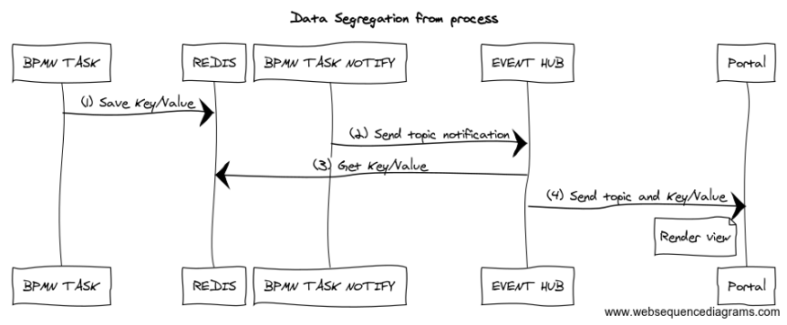
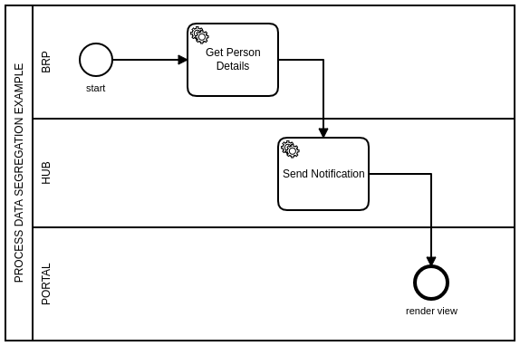
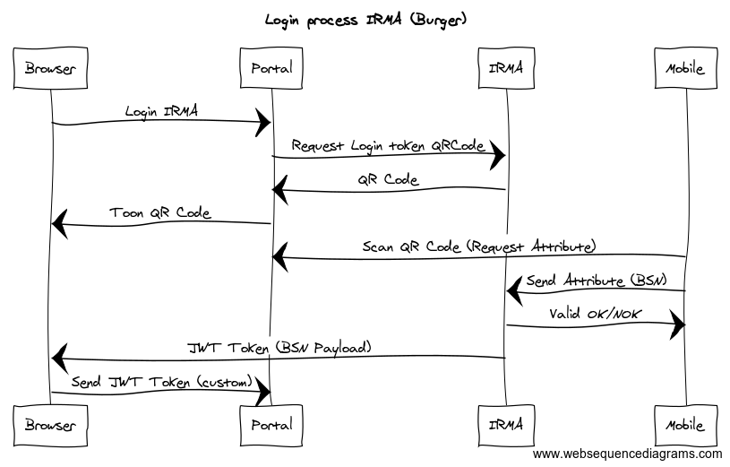

# fieldlab-business-processes
[](https://travis-ci.org/wigo4it/fieldlab-business-processes)  
Business Processes within the fieldlab. The workings descibed are experimental.

## Folder Structures

Each business process will have its own directory, containing a ./doc folder for process documentation (preferably in markup format), and ./src folder for process execution.

## Processes

### Topic Notifications
Sends topic messages to the SignalR Server.
documentation [here](./notification/README.md)

### Request City Pass
Citizen process for requesting a city pass [here](./city-pass/doc/readme.md)

## Common process sequences

### (view)data Segregation from bpmn processes

The lab contains common process sequences that offer decoupling process specific data from (view) data that is used for the user interface. The following example combines the BPMN process with memory caching in Redis and live signalling using a websockets based event hub called SignalR. SignaR pushes data to a portal user interface.



1. A camunda **bpmn task** caches (view)data in the redis memory cluster with a certain key/value pair.
2. A generic camunda task called: Notify then notifies the SignalR Event hub with a certain topic and message.
3. The event hub discovers the message contains a value that starts with: redis_get! and knows to lookup the key value stored under (1)
4. The event hub enriches the original topic/message payload with the view data stored in redis and pushes it to the portal UI.

The view can now be rendered in the portal by binding to the Key/Value payload that originally came from redis cache.

Viewed from a BPMN modelling perspective:  



### IRMA Login / Attribute flow




#### BPMN Task Notify

BPMN Task notify will push the following payload to signalr. It consists out of 3 properties:

1. topicid
2. notificationmessage
3. processdata payload

Property 1 and 2 are introduced so you can easily reference them without having to deserialize the json into an object. **Although we are planning to entirely remove them** in the furture and introduce a slim domain model for the properties needed.

```json
{
  "ActivityId": "Task_18js4xc",
  "ActivityInstanceId": "Task_18js4xc:18e157c2-b739-11e8-81fc-0242ac120003",
  "ProcessInstanceId": "18e09468-b739-11e8-81fc-0242ac120003",
  "ProcessDefinitionId": "notification:1:6e49b309-b607-11e8-86b9-0242ac120008",
  "Id": "18e17dd3-b739-11e8-81fc-0242ac120003",
  "Retries": null,
  "Variables": {
    "topicid": {
      "Type": "String",
      "Value": "topic",
      "ValueInfo": {}
    },
    "notificationmessage": {
      "Type": "String",
      "Value": "hi",
      "ValueInfo": {}
    }
  },
  "TopicName": "send-notification",
  "WorkerId": "689f92c0-e96f-4cee-b64f-06ec0903630a",
  "Priority": 0
}
```

#### BPMN Task storing data

As described earlier, a process worker typically stores its data in Redis cache so the front end can then later recieve it through a BPMN notification through a SignalR push mechanism.

Here's such a commonly used BPMN Task sequence, that decouples the front end from having to query an openapi service and lies the responsibility in of that in the the process worker. Hereby the process becomes the centric part of the system where everything revolves around.

1. topic
*Example*
```

```
2. notificationmessage
*Example*
```Json
{
    "operation" : "redis_get_string",
    "key" : "oas2-brp-1162160216"
}
```


3. data
4. processdata


