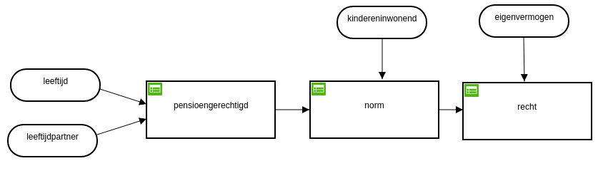
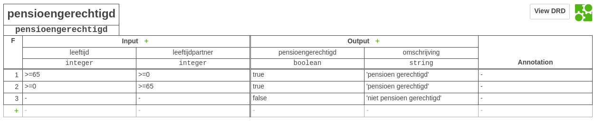
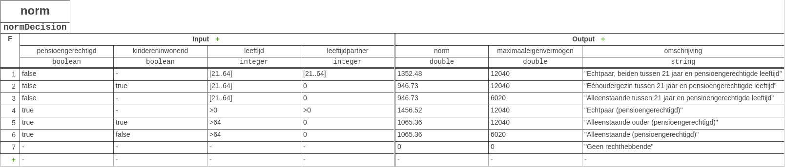
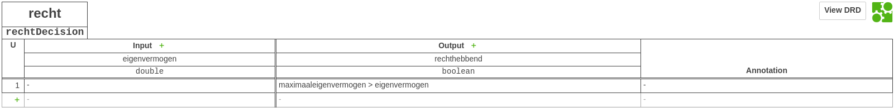
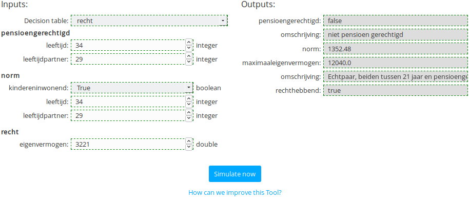
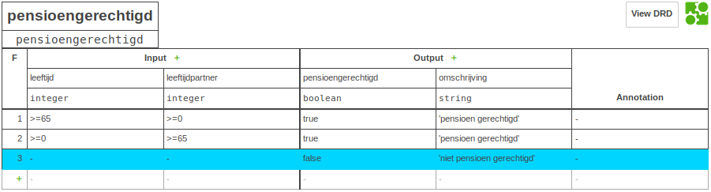
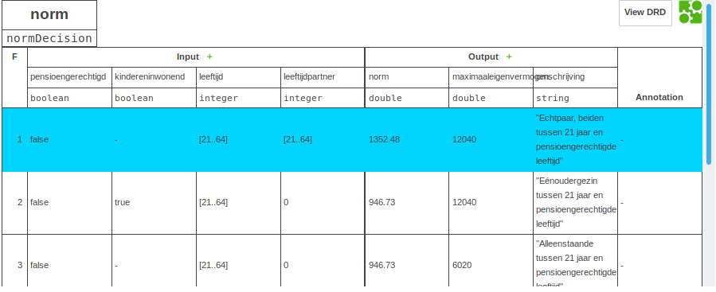
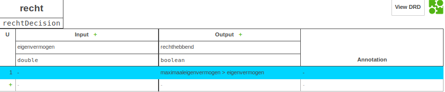

# Bijstandsaanvraagproces

This is a small test using mainly DMN decision tables to calculate / determine if a citizen has the right to receive welfare. These descriptions are in Dutch. The example is meant to be technical and does not neccesarily reflect actual law.

## Decision Diagram (Overview)

### Decision Table (Pensioen Gerechtigd)

### Decision Table (Norm)

### Decision Table (Recht)

## Decision Execution

### Decision Table Trace (Pensioen Gerechtigd)

### Decision Table Trace (Norm)

### Decision Table Trace (Recht)

