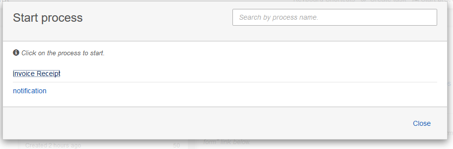
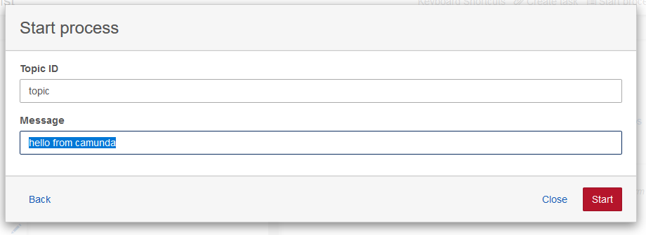
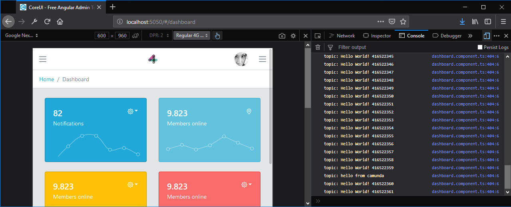

# Notification task

The following external task sends topic messages to the SignalR Server.

## BPMN Example:


```
dotnet run ./notification/src/notification
```

### Start the process called: Notification from camunda



### Enter topic data for the notification



### Dashboard will show the number of notifications


